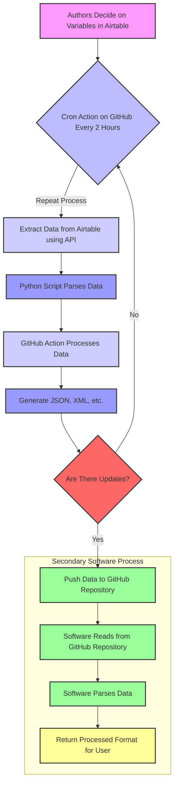

# Structure Diagram
 This needs to be updated to reflect the process.

```mermaid
graph TD
    style A fill:#f9f,stroke:#333,stroke-width:2px;
    style B fill:#bbf,stroke:#333,stroke-width:2px;
    style C fill:#ccf,stroke:#333,stroke-width:2px;
    style D fill:#99f,stroke:#333,stroke-width:2px;
    style E fill:#ccf,stroke:#333,stroke-width:2px;
    style F fill:#99f,stroke:#333,stroke-width:2px;
    style G fill:#f66,stroke:#333,stroke-width:2px;
    style H fill:#9f9,stroke:#333,stroke-width:2px;
    style I fill:#9f9,stroke:#333,stroke-width:2px;
    style J fill:#9f9,stroke:#333,stroke-width:2px;
    style K fill:#ff9,stroke:#333,stroke-width:2px;
    
    A[Authors Decide on Variables in Airtable] --> B{Cron Action on GitHub Every 2 Hours}
    B --> |Repeat Process| C[Extract Data from Airtable using API]
    C --> D[Python Script Parses Data]
    D --> E[GitHub Action Processes Data]
    E --> F[Generate JSON, XML, etc.]
    F --> G{Are There Updates?}
    G --> |Yes| H[Push Data to GitHub Repository]
    G --> |No| B

    subgraph Secondary Process [Secondary Software Process]
        H --> I[Software Reads from GitHub Repository]
        I --> J[Software Parses Data]
        J --> K[Return Processed Format for User]
    end

```
